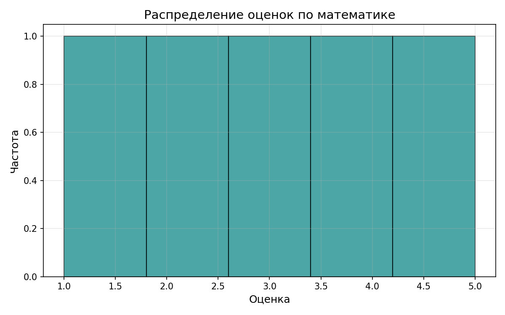
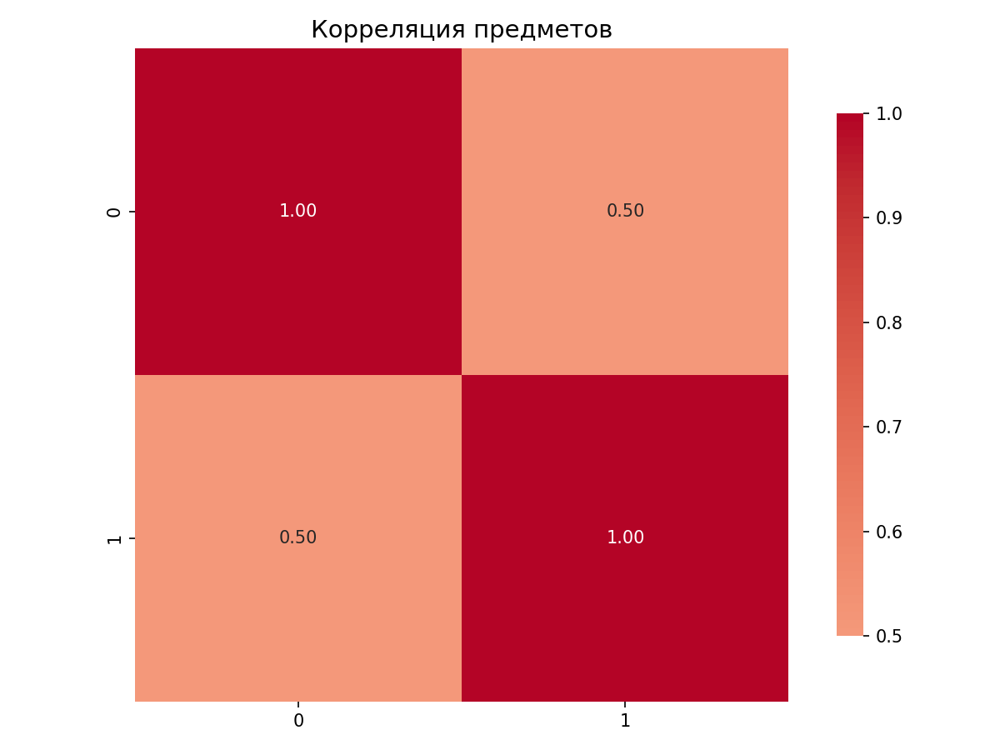
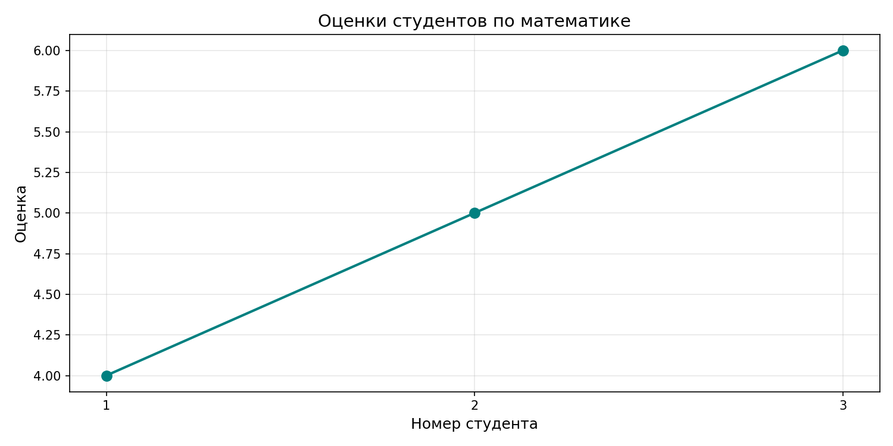

# Лабораторная работа №2
## Численные вычисления и анализ данных с использованием NumPy


### Тема:Основы NumPy: массивы и векторные операции

### Цель:
Освоить базовые операции с массивами NumPy, научиться выполнять векторные и матричные вычисления, проводить статистический анализ данных и визуализировать результаты.

### Задание:
Реализовать все функции в файле `main.py`, чтобы проходили тесты:

1. **Создание и обработка массивов**
   - `create_vector()` — создать массив от 0 до 9
   - `create_matrix()` — создать матрицу 5x5 со случайными числами
   - `reshape_vector()` — преобразовать (10,) → (2,5)
   - `transpose_matrix()` — транспонирование матрицы

2. **Векторные операции**
   - `vector_add()` — сложение векторов
   - `scalar_multiply()` — умножение вектора на число
   - `elementwise_multiply()` — поэлементное умножение
   - `dot_product()` — скалярное произведение

3. **Матричные операции**
   - `matrix_multiply()` — умножение матриц
   - `matrix_determinant()` — определитель матрицы
   - `matrix_inverse()` — обратная матрица
   - `solve_linear_system()` — решение системы Ax = b

4. **Статистический анализ**
   - `load_dataset()` — загрузка CSV в NumPy массив
   - `statistical_analysis()` — среднее, медиана, std, min, max, перцентили
   - `normalize_data()` — Min-Max нормализация

5. **Визуализация**
   - `plot_histogram()` — гистограмма распределения оценок
   - `plot_heatmap()` — тепловая карта корреляции
   - `plot_line()` — график зависимости оценок студентов

---


### Код:
```bash
import numpy as np
import pandas as pd
import matplotlib.pyplot as plt
import seaborn as sns


#============================================================
# 1. СОЗДАНИЕ И ОБРАБОТКА МАССИВОВ
#============================================================

def create_vector():
    """
     Создать массив от 0 до 9.

    Returns:
         numpy.ndarray: Массив чисел от 0 до 9 включительно
    """
    return np.arange(10)


def create_matrix():
    """
    Создать матрицу 5x5 со случайными числами в диапазоне [0, 1].

    Returns:
        numpy.ndarray: Матрица 5x5 со случайными значениями от 0 до 1

    """
    return np.random.rand(5, 5)


def reshape_vector(vec):
    """
    Преобразовать вектор из формы (10,) в матрицу формы (2, 5).

    Args:
        vec (numpy.ndarray): Входной массив формы (10,)

    Returns:
        numpy.ndarray: Преобразованный массив формы (2, 5)

    """
    return vec.reshape(2, 5) # .reshape() - метод, изменяющий форму массива без изменения данных


def transpose_matrix(mat):
    """
    Транспонирование матрицы.

    Args:
        mat (numpy.ndarray): Входная матрица формы (m, n)

    Returns:
        numpy.ndarray: Транспонированная матрица формы (n, m)

    """
    return mat.T


# ============================================================
# 2. ВЕКТОРНЫЕ ОПЕРАЦИИ
# ============================================================

def vector_add(a, b):
    """
    Сложение векторов одинаковой длины (поэлементно).

    Args:
        a (numpy.ndarray): Первый вектор
        b (numpy.ndarray): Второй вектор

    Returns:
        numpy.ndarray: Результат поэлементного сложения

    """
    return a +b


def scalar_multiply(vec, scalar):
    """
    Умножение вектора на число.

    Args:
        vec (numpy.ndarray): Входной вектор
        scalar (float/int): Число для умножения

    Returns:
        numpy.ndarray: Результат умножения вектора на скаляр

    """
    return vec * scalar


def elementwise_multiply(a, b):
    """
    Поэлементное умножение (произведение Адамара).

    Args:
        a (numpy.ndarray): Первый вектор/матрица
        b (numpy.ndarray): Второй вектор/матрица

    Returns:
        numpy.ndarray: Результат поэлементного умножения

    """
    return a * b


def dot_product(a, b):
    """
    Скалярное произведение векторов.

    Args:
        a (numpy.ndarray): Первый вектор
        b (numpy.ndarray): Второй вектор

    Returns:
        float: Скалярное произведение векторов

    """
    return np.dot(a, b)


# ============================================================
# 3. МАТРИЧНЫЕ ОПЕРАЦИИ
# ============================================================

def matrix_multiply(a, b):
    """
    Умножение матриц.

    Args:
        a (numpy.ndarray): Первая матрица формы (m, n)
        b (numpy.ndarray): Вторая матрица формы (n, p)

    Returns:
        numpy.ndarray: Результат умножения матриц формы (m, p)

    """
    return a @ b


def matrix_determinant(a):
    """
    Вычисление определителя квадратной матрицы.

    Args:
        a (numpy.ndarray): Квадратная матрица

    Returns:
        float: Определитель матрицы

    """
    return np.linalg.det(a) #.linalg - подмодуль линейной алгебры


def matrix_inverse(a):
    """
    Вычисление обратной матрицы.

    Args:
        a (numpy.ndarray): Квадратная матрица

    Returns:
        numpy.ndarray: Обратная матрица

    """
    return np.linalg.inv(a)


def solve_linear_system(a, b):
    """
    Решение системы линейных уравнений Ax = b.

    Args:
        a (numpy.ndarray): Матрица коэффициентов A
        b (numpy.ndarray): Вектор свободных членов b

    Returns:
        numpy.ndarray: Решение системы x

    """
    return np.linalg.solve(a, b) # 1. Разлагает матрицу A = L × U (L - нижняя, U - верхняя треугольные)
                                 # 2. Решает L × y = b (прямая подстановка)
                                 # 3. Решает U × x = y (обратная подстановка)


# ============================================================
# 4. СТАТИСТИЧЕСКИЙ АНАЛИЗ
# ============================================================

def load_dataset(path="data/students_scores.csv"):
    """
    Загрузить CSV файл и вернуть NumPy массив.

    Args:
        path (str): Путь к CSV файлу. По умолчанию "data/students_scores.csv"

    Returns:
        numpy.ndarray: Загруженные данные в виде массива

    """
    return pd.read_csv(path).to_numpy()


def statistical_analysis(data):
    """
    Выполнить статистический анализ одномерных данных.

    Args:
        data (numpy.ndarray): Одномерный массив данных

    Returns:
        dict: Словарь со статистическими показателями:
            - mean (float): среднее арифметическое
            - median (float): медиана
            - std (float): стандартное отклонение ( Шаг 1: Разности с средним, Шаг 2: Квадраты разностей,Шаг 3: Среднее квадратов,Шаг 4: Корень из дисперсии)
            - min (float): минимальное значение
            - max (float): максимальное значение
            - percentile_25 (float): 25-й перцентиль (Сортируем, 25% от 10 элементов = 2.5, интерполяция между 2-м и 3-м)
            - percentile_75 (float): 75-й перцентиль

    """
    return {
        "mean": np.mean(data),
        "median": np.median(data),
        "std": np.std(data),
        "min": np.min(data),
        "max": np.max(data),
        "percentile_25": np.percentile(data, 25),
        "percentile_75": np.percentile(data, 75)
    }


def normalize_data(data):
    """
    Выполнить Min-Max нормализацию данных.
    Формула: (x - min) / (max - min)

    Args:
        data (numpy.ndarray): Входной массив данных

    Returns:
        numpy.ndarray: Нормализованный массив данных в диапазоне [0, 1]

    """
    min_val = np.min(data)
    max_val = np.max(data)
    return (data - min_val) / (max_val - min_val)


# ============================================================
# 5. ВИЗУАЛИЗАЦИЯ
# ============================================================

def plot_histogram(data, save_path="plots/histogram.png"):
    """
    Построить гистограмму распределения данных.

    Args:
        data (numpy.ndarray): Данные для гистограммы
        save_path (str): Путь для сохранения графика

    Returns:
        str: Путь к сохранённому файлу

    """
    plt.figure(figsize=(8, 5)) # создаёт новое окно для графика
    plt.hist(data, bins=5, edgecolor='black', color='teal', alpha=0.7) # bins=5 - количество столбцов (интервалов) на гистограмме, alpha=0.7 - прозрачность
    plt.title('Распределение оценок по математике', fontsize=14)
    plt.xlabel('Оценка', fontsize=12) #.xlabel() - метод для установки подписи оси X
    plt.ylabel('Частота', fontsize=12)
    plt.grid(True, alpha=0.3) #plt.grid() - метод для отображения сетки на графике (True - включает сетку)
    plt.tight_layout() #.tight_layout() - метод автоматической настройки отступов и расположения элементов
    plt.savefig(save_path, dpi=150) # cохраняет текущий график (фигуру) в файл с указанными параметрами
    plt.close()
    return save_path


def plot_heatmap(matrix, save_path="plots/heatmap.png"):
    """
    Построить тепловую карту корреляции.

    Args:
        matrix (numpy.ndarray): Матрица корреляции
        save_path (str): Путь для сохранения графика

    Returns:
        str: Путь к сохранённому файлу

    """
    plt.figure(figsize=(8, 6))
    sns.heatmap(
        matrix, # данные для отображения
        annot=True,  # показывать числовые значения внутри ячеек
        cmap='coolwarm', # цветовая схема
        center=0,  # центр цветовой шкалы в 0
        fmt='.2f', # формат чисел: 2 знака после запятой
        square=True,  # ячейки квадратные
        cbar_kws={'shrink': 0.8} # уменьшить цветовую шкалу до 80% от высоты графика
    )
    plt.title('Корреляция предметов', fontsize=14)
    plt.tight_layout() # автоматически подгоняет элементы, чтобы ничего не обрезалось
    plt.savefig(save_path, dpi=150)
    plt.close()
    return save_path


def plot_line(x, y, save_path="plots/line_plot.png"):
    """
    Построить линейный график зависимости.

    Args:
        x (numpy.ndarray): Значения по оси X (номера студентов)
        y (numpy.ndarray): Значения по оси Y (оценки)
        save_path (str): Путь для сохранения графика

    Returns:
        str: Путь к сохранённому файлу

    """
    plt.figure(figsize=(10, 5))
    plt.plot(x, y, marker='o', linestyle='-', linewidth=2, markersize=8, color='teal') # маркер в виде кружка на каждой точке
    plt.title('Оценки студентов по математике', fontsize=14)
    plt.xlabel('Номер студента', fontsize=12)
    plt.ylabel('Оценка', fontsize=12)
    plt.grid(True, alpha=0.3) # Включить сетку с прозрачностью 30%
    plt.xticks(x)
    plt.tight_layout() # чтобы заголовок/подписи не обрезались
    plt.savefig(save_path, dpi=150)
    plt.close()
    return save_path
    
import os
import numpy as np
import pytest

from main import (
    create_vector,
    create_matrix,
    reshape_vector,
    transpose_matrix,
    vector_add,
    scalar_multiply,
    elementwise_multiply,
    dot_product,
    matrix_multiply,
    matrix_determinant,
    matrix_inverse,
    solve_linear_system,
    load_dataset,
    statistical_analysis,
    normalize_data,
    plot_histogram,
    plot_heatmap,
    plot_line
)

def test_create_vector():
    v = create_vector()
    assert isinstance(v, np.ndarray)
    assert v.shape == (10,)
    assert np.array_equal(v, np.arange(10))


def test_create_matrix():
    m = create_matrix()
    assert isinstance(m, np.ndarray)
    assert m.shape == (5, 5)
    assert np.all((m >= 0) & (m < 1))


def test_reshape_vector():
    v = np.arange(10)
    reshaped = reshape_vector(v)
    assert reshaped.shape == (2, 5)
    assert reshaped[0, 0] == 0
    assert reshaped[1, 4] == 9


def test_vector_add():
    assert np.array_equal(
        vector_add(np.array([1,2,3]), np.array([4,5,6])),
        np.array([5,7,9])
    )
    assert np.array_equal(
        vector_add(np.array([0,1]), np.array([1,1])),
        np.array([1,2])
    )


def test_scalar_multiply():
    assert np.array_equal(
        scalar_multiply(np.array([1,2,3]), 2),
        np.array([2,4,6])
    )


def test_elementwise_multiply():
    assert np.array_equal(
        elementwise_multiply(np.array([1,2,3]), np.array([4,5,6])),
        np.array([4,10,18])
    )
def test_dot_product():
    assert dot_product(np.array([1,2,3]), np.array([4,5,6])) == 32
    assert dot_product(np.array([2,0]), np.array([3,5])) == 6


def test_matrix_multiply():
    A = np.array([[1,2],[3,4]])
    B = np.array([[2,0],[1,2]])
    assert np.array_equal(matrix_multiply(A,B), A @ B)


def test_matrix_determinant():
    A = np.array([[1,2],[3,4]])
    assert round(matrix_determinant(A),5) == -2.0


def test_matrix_inverse():
    A = np.array([[1,2],[3,4]])
    invA = matrix_inverse(A)
    assert np.allclose(A @ invA, np.eye(2))


def test_solve_linear_system():
    A = np.array([[2,1],[1,3]])
    b = np.array([1,2])
    x = solve_linear_system(A,b)
    assert np.allclose(A @ x, b)


def test_load_dataset():
    # Для теста создадим временный файл
    test_data = "math,physics,informatics\n78,81,90\n85,89,88"
    with open("test_data.csv", "w") as f:
        f.write(test_data)
    try:
        data = load_dataset("test_data.csv")
        assert data.shape == (2, 3)
        assert np.array_equal(data[0], [78,81,90])
    finally:
        os.remove("test_data.csv")


def test_statistical_analysis():
    data = np.array([10,20,30])
    result = statistical_analysis(data)
    assert result["mean"] == 20
    assert result["min"] == 10
    assert result["max"] == 30


def test_normalize_data():
    data = np.array([0,5,10])
    norm = normalize_data(data)
    assert np.allclose(norm, np.array([0,0.5,1]))


def test_plot_histogram():
    # Просто проверяем, что функция не падает
    data = np.array([1,2,3,4,5])
    plot_histogram(data)

def test_plot_heatmap():
    matrix = np.array([[1,0.5],[0.5,1]])
    plot_heatmap(matrix)


def test_plot_line():
    x = np.array([1,2,3])
    y = np.array([4,5,6])
    plot_line(x, y)

def test_transpose_matrix():
    m = np.array([[1, 2, 3], [4, 5, 6]])
    transposed = transpose_matrix(m)
    assert transposed.shape == (3, 2)
    assert np.array_equal(transposed, np.array([[1, 4], [2, 5], [3, 6]]))


if __name__ == "__main__":
    print("Запустите python3 -m pytest test.py -v для проверки лабораторной работы.")    
```
### Гистограмма распределения оценок:


### Тепловая карта корреляции:


### Линейный график успеваемости:


### Вывод: 
Лабораторная работа выполнена.
В ходе выполнения лабораторной работы были освоены базовые операции с массивами NumPy, выполнены векторные и матричные вычисления, проведён статистический анализ данных и построены графики.